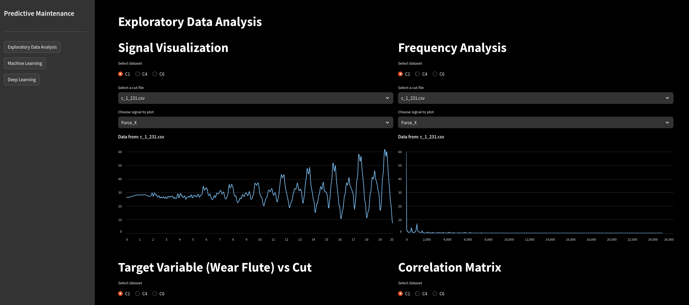

# Predictive Maintenance Project @ ICT Camp English 2024

The goal of this project is to analyze a real machine monitoring dataset and create a machine learning model to predict when the machine being monitored requires maintenance.

## Dataset

This project uses the data provided for the [2010 PHM Society Conference Data Challenge](https://phmsociety.org/phm_competition/2010-phm-society-conference-data-challenge/). The challenge focused on RUL (remaining useful life) estimation for a high-speed CNC (computer numerical control) milling machine cutter using measurements from:

- **Dynamometers**: Force readings on the pieces being cut.
- **Accelerometers**: Vibration data during cutting operations.
- **Acoustic emission sensors**: High-frequency energy emissions linked to tool wear.

### Data source and License

- The data set is publicly available on Kaggle: [PHM data challenge 2010](https://www.kaggle.com/datasets/rabahba/phm-data-challenge-2010?resource=download)
- Licensed under [CC0-1.0](https://creativecommons.org/publicdomain/zero/1.0/deed.en).

## Tech stack

  

## Notebooks

Most of the work was done in Jupyter notebooks, in them you can find a mix of written analysis, code, diagrams and data visualization.

| Notebook                                                                                                       | Description                                                                             |
| -------------------------------------------------------------------------------------------------------------- | --------------------------------------------------------------------------------------- |
| [1.0-exploratory-data-analysis.ipynb](notebooks/1.0-exploratory-data-analysis.ipynb)                           | Initial data exploration and visualization.                                             |
| [2.0-ep-correlation-analysis.ipynb](notebooks/2.0-ep-correlation-analysis.ipynb)                               | In-depth analysis of the correlations between variable statistics and target variables. |
| [3.0-drs-frequency-feature-engineering.ipynb](notebooks/3.0-drs-frequency-feature-engineering.ipynb)           | Feature extraction from frequency spectrum using wavelet transforms.                    |
| [4.0-ep-linear-regression-c1-self-selective.ipynb](notebooks/4.0-ep-linear-regression-c1-self-selective.ipynb) | Training and evaluation of a multi-output Lasso regression model.                       |
| [5.0-drs-deep-learning-modeling.ipynb](notebooks/5.0-drs-deep-learning-modeling.ipynb)                         | Training and evaluation of a 1-dimensional CNN model for regression.                    |

## Dashboard

A dashboard was built with [Streamlit](https://streamlit.io/) to visualize key insights from the data analysis and model predictions. It was developed in a separate [GitHub repo](https://github.com/DavidRamosSal/ICTStreamlit) but you can explore it directly at:

- **[Live Dashboard](https://ict-camp-predictive-maintenance.streamlit.app/)**

    

## Acknowledgments

Contributors:

- [DavidRamosSal](https://github.com/DavidRamosSal)
- [edinapetroczki](https://github.com/edinapetroczki)
- [djamiemartin](https://github.com/djamiemartin)
- [Clemso007](https://github.com/Clemso007)
- [dermot-lyons](https://github.com/dermot-lyons)
